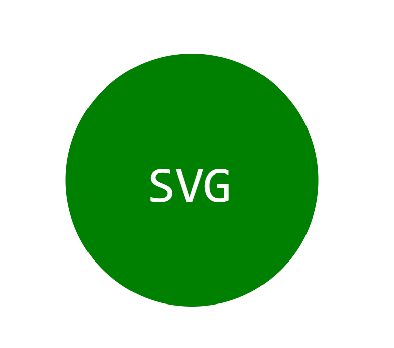

# Logo Creator 

# Table of Contents
* [Usage](#usage)
* [Description](#usage)
* [Installation](#installation)
* [Test](#test)
* [Screenshots](#screenshots)
* [Contributors](#contributors)
* [License](#license)
* [Contacts](#contacts)
  
## Usage
This app is use to create a logo for user
  
## Description
This app includes a series of question of what the user wants to include in the logo. Once the user opens the console, they will be prompted to include 3 letters to include in the logo, follow but the color of the text, shape, and the color of the shape and a logo.svg file will be created and right click on the logo.svg file and open with live server. Follow the installation process under installation section and under test section, there is a tutorial link on how to use the console. 
  
## Installation
Repo: https://github.com/jayP308/e_gen_logo

- Click on the link above to view my repository
- Click on the green button that says "Code"
- Copy the SSH Link
- Go to your terminal, you can create an empty folder if you like
- Inside that folder, git clone "ssh link" 
- You can stay on terminal or open inside the a code editor
- From here, you can run "node ./index.js" (Video Tutorial Under Test Section)

## Test
Inside the app with terminal open, run "node index.js" and questions where user can input text, color of the text, choose a shape, and choose a color of the shape will be displayed.

Tutorial Video Link
https://drive.google.com/file/d/1vdI-jkfLfO02A6jetUbWsjNRH94J6o9-/view

## Screenshots

## Contributors
Junnel R. Padilla, UC Berkeley Bootcamp Modules, ChatGPT
  
## License
This project is licensed under [MIT](https://opensource.org/licenses/MIT)

## Questions?
* Name: Junnel R. Padilla
* Github: https://github.com/jayP308
* LinkedIn: https://www.linkedin.com/in/jp-padilla-038854251/